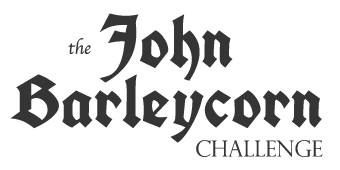

<div align='center'>
    
    <p><i>Visualizing the text of John Barleycorn by Jack London as a drinking game</i></p>
</div>


# About
*The John Barleycorn Challenge* is a playful look at Jack London's writing about alcoholism in his novel [*John Barleycorn*](https://www.gutenberg.org/ebooks/318). The project examines what would happen if one were to treat the text of *John Barleycorn* as a drinking game, taking a dose of alcohol every time the words "John Barleycorn" appear in the text. Spoiler alert: it usually does not end well.

The site allows your to configure a few different variables in the the scenario, including:

- Reading rate
- Reader weight and sex
- Type of alcohol


Blood alcohol content calculations are based on [this paper from the National Highway Traffic Safety Administration](https://web.archive.org/web/20040202204141/www.nhtsa.dot.gov/people/injury/alcohol/bacreport.html). The current calculations have a few key limitations:

- Uptake is instantaneous. No time is allowed for drinking or for the body to begin absorbing the alcohol.
- Each drink is processed independently by the body.
- Metabolic rate is constant. In the model, alcohol is metabolized at a linear rate.
- Reading rate is fixed. This may not be a realistic assumption, especially at higher BAC levels.


# Building
The site uses typescript and webpack. To build:

```bash
npm install
webpack --watch
```

Main code is located the `src` directory and output to `dist`
